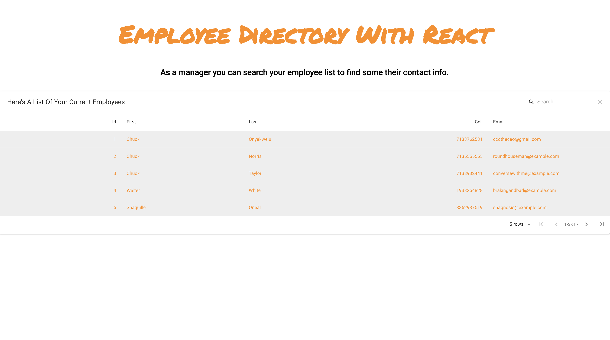

# Employee-Directory-React

## Overview

For this assignment, I have created an employee directory with React. This assignment will required me to break up youmyr application's UI into components, manage component state, and respond to user events.

I also used material-table to create my table. I tried to use bootstrap-react but after researching i found material-table to be easier.

## User Story

* As a user, I want to be able to view my entire employee directory at once so that I have quick access to their information.

## Business Context

An employee or manager would benefit greatly from being able to view non-sensitive data about other employees. It would be particularly helpful to be able to filter employees by name.

## Acceptance Criteria

Given a table of random users, when the user loads the page, a table of employees should render. 

The user should be able to:

  * Sort the table by at least one category

  * Filter the users by at least one property.

## ScreenShot




## Built With

```
-CSS
-React
-Node
-HTML
-Bootstrap
```
